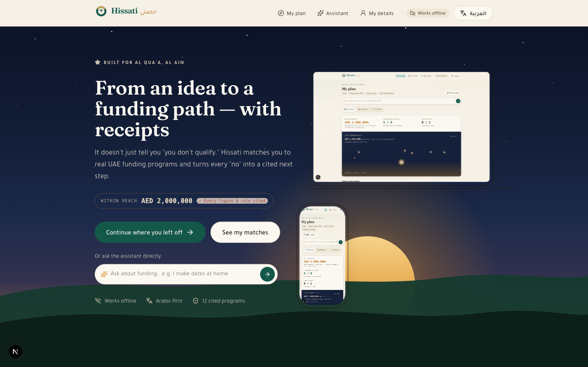
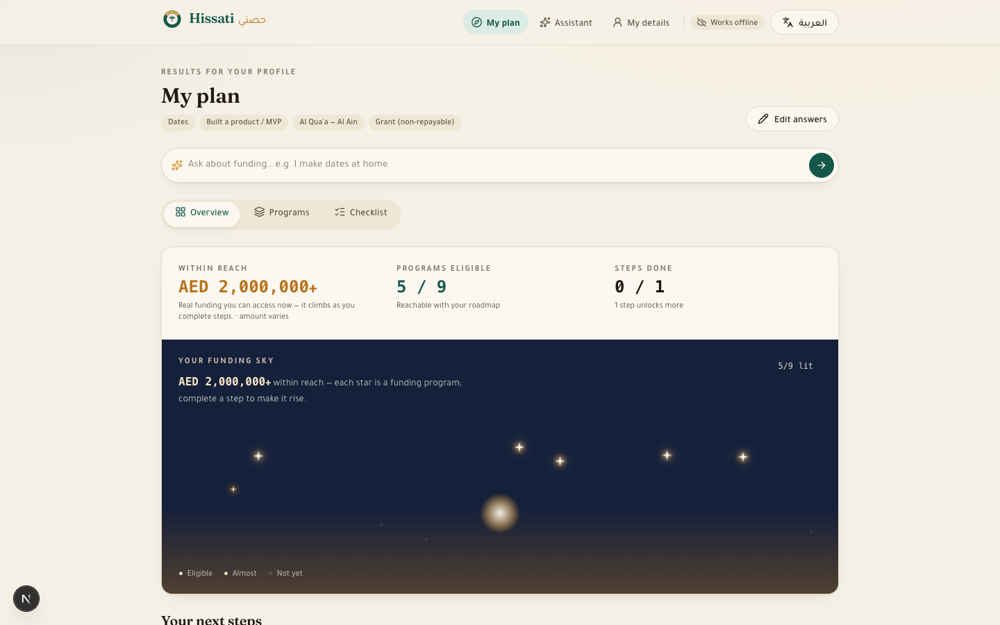
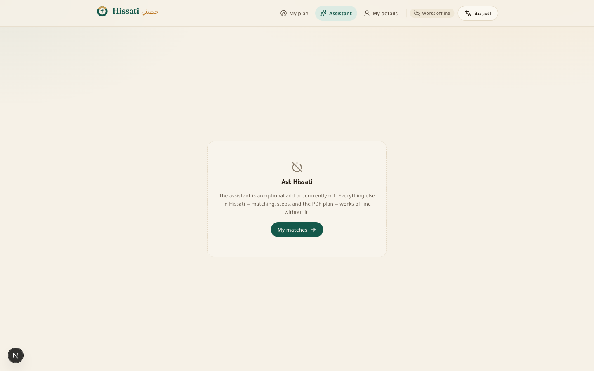
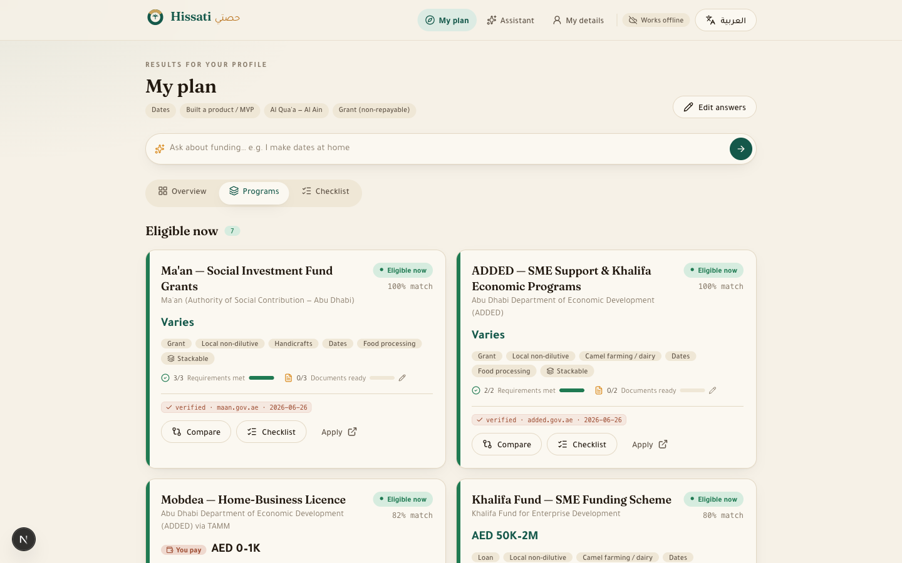

# Hissati · حِصّتي — a funding-readiness navigator

**Hissati** ("my share") is a bilingual, offline-first web app that matches a UAE founder to **real funding programs** and, for the ones they don't yet qualify for, names the **exact blocking rule** and generates the **shortest cited path** to becoming eligible. It turns every *"you don't qualify"* into a sequenced, sourced next step.

> **Tatweer Hackathon — Challenge 1: Taking the first entrepreneurial step.**
> Built for first-time founders in **Al Qua'a, Al Ain**. Arabic-first, works in airplane mode.

**Code:** this repo · **Verify:** `npm install && npm test` → **49 passing tests** · **Run:** `npm run dev`



---

## 1. The challenge & the specific problem

We chose **Challenge 1 — taking the first entrepreneurial step**. The barrier for a first-time founder is rarely ambition; it's not knowing the first move — *which* program, *what* it requires, and *what to do* when the answer is "not yet."

Every existing tool dead-ends at "no." Khalifa Fund ships a single-fund eligibility calculator; everything else is a static listicle. All of them tell a first-time founder *"you don't qualify"* and stop. **Hissati inverts that:** it treats non-eligibility as the *starting point* and produces the cited path forward — with **zero dead-ends**.

## 2. Who it's for, and their situation

- **Primary persona — a first-time founder, idea/early stage, not yet registered** (e.g. an Emirati woman making **date products at home** in Al Qua'a). Every existing tool rejects her; the readiness *path* is the value.
- Al Qua'a is a **dispersed, low-connectivity** rural community where camel and date farming dominate. So the app is **offline-first** and **Arabic-first** — it works on weak or no connection, in the user's language and script (full RTL).
- Also served: an operating camel/dairy farmer seeking expansion funding, and an MVP-stage tech founder eligible for the "stretch tier" (Hub71, Sheraa, Khalifa Award).

## 3. The solution & its impact — with testable claims

A short, adaptive **Arabic-first questionnaire** (≈6 questions) → a **deterministic** engine classifies every program **Eligible now / Almost eligible / Not a fit**, naming the blocking rule → a 3-tab **dashboard** (Overview · Programs · Checklist) → a per-program **checklist** → a one-tap **Arabic PDF plan** and a **WhatsApp / QR share**.

The headline is one honest, cited number: **"AED within reach."** It sums only the structured upper bound (`max_aed`) of the programs you are **eligible for today** — funding instruments only, with **trade licences excluded** (a licence is a fee you *pay*, a rung on the path, not money you receive). Nothing is inflated or scraped from prose; every counted dirham is a real, cited figure. The number **climbs as the founder completes roadmap steps** — the live "watch it climb" demo moment, made of real money.



**Testable claims (verify each in minutes — see §5):**

1. **12 UAE funding programs across 3 tiers** (9 funding instruments + 3 licence rungs), each linked to a primary source with a verified date. → `src/data/programs.json`, validated by `tests/programs.test.ts`.
2. **The "AED within reach" climb is reproducible:** for the Al Qua'a date-products founder it rises **AED 0 → 0 → 2,000,000** as she goes *idea → registers a licence → launches an MVP*, while **eligible funding programs go 0 → 2 → 5 → 6**. The **Khalifa Fund AED 2,000,000 loan flips *almost → eligible* at the MVP step.** → asserted exactly in `tests/metrics.test.ts`.
3. **Zero dead-ends.** Every "almost" program carries ≥1 cited, remediable step; every non-match names its blocking rule. → no-dead-end invariant in `tests/engine.test.ts`; completeness (no orphan rules/questions) in `tests/completeness.test.ts`.
4. **Deterministic, in-browser, no-network core.** Matching, the metric, and the per-program match score are pure functions over a bundled dataset — no API call for a result, so a match returns in **well under 1 s, offline or on throttled 3G**. → `npm test` (49 tests).
5. **Full core flow runs offline** — the knowledge base is `import`ed JSON inlined into the JS bundle, and a hand-written service worker precaches the app shell. → see `public/sw.js`; airplane-mode screen capture in `docs/`.

> **The metric never inflates.** Programs whose award is not publicly fixed (Ma'an, ADDED, the Khalifa Award, the VCs) contribute **0** and flip a "+ amounts vary" flag in the UI rather than invent a figure. That is *why* the idea-stage founder honestly reads **AED 0** even though some licences are already "eligible" for her — they're not money in hand. See `src/lib/metrics.ts`.

## 4. Feasibility, deployment & scalability

- **Feasibility / deployment.** Pure front-end PWA (Next.js, App Router) on Vercel's free tier. No backend, no database, no login — the only optional network call is the LLM assistant, which is **off by default**. Maintenance is editing one cited JSON file.
- **Scalability.** Adding a program is **data-only**: one record in `programs.json` that validates against the Zod schema — the engine already interprets every rule via a frozen grammar. Expanding to another emirate is an `in`-rule on the `location` enum; **no engine change.** The rural-first wedge ships first; the wider UAE ecosystem (accelerators, VCs) is already included as higher "stretch" tiers, proving the rule-swap model.

## 5. How to run & verify it

```bash
npm install
npm test        # 49 Vitest tests — the deterministic core (this is the criterion-6 evidence)
npm run dev     # http://localhost:3000
npm run build   # production build (Turbopack) — also runs the full TS typecheck
```

**Verify the headline claims directly:**

| Claim | Command / file |
|---|---|
| **AED within reach** climbs `0 → 0 → 2,000,000`; eligible programs `0 → 2 → 5 → 6`; Khalifa flips at the MVP step | `npx vitest run tests/metrics.test.ts` |
| Per-program **match score** worked examples + the Khalifa flip | `npx vitest run tests/scoring.test.ts` |
| 3-bucket classification + **no dead-ends** | `npx vitest run tests/engine.test.ts` |
| **No orphan** rules/questions (questionnaire is complete vs the schema) | `npx vitest run tests/completeness.test.ts` |
| 12 programs, ≥6 currently-open & cited, dataset validates against Zod | `npx vitest run tests/programs.test.ts` |
| Offline | `npm run build`, serve, open DevTools → Network → *Offline*, reload — the flow still works |

**Tools:** Next.js 16 (App Router, Turbopack) · React 19 · TypeScript · Tailwind v4 (CSS-first `@theme`, no config file) · Zod (schema/validation) · Zustand + persist (offline state) · Vitest (tests) · self-hosted **Tajawal + Fraunces + IBM Plex Mono** via `next/font` (no runtime CDN) · html2canvas + jsPDF (Arabic PDF) · qrcode-generator (share QR) · hand-written service worker (offline) · Vercel (hosting).

**Optional grounded assistant (off by default).** Set `ANTHROPIC_API_KEY` (server-side) to enable an in-app assistant. It is **tool-calling only** — the model calls domain tools (`src/lib/agent-tools.ts`) that wrap the *same* deterministic matcher, and the app renders all UI from the structured results; the model never emits funding facts or HTML, and it surfaces every tool call as a cited "checked …" chip. With no key, the route reports disabled and the UI degrades to a friendly notice — the offline core is completely unaffected.



**Evidence in [`docs/`](docs/):**

- `docs/screenshots/landing.png`, `dashboard-overview.png`, `programs.png`, `assistant-off.png`, `dashboard-mobile.png` — the shipped UI (captured by driving a real Chrome through the full flow).
- `docs/sample-plan-ar.pdf` / `docs/sample-plan-en.pdf` — the one-tap Arabic & English PDF plan (end-to-end-export proof).
- `docs/07-offline.png` — a results page rendering with the network **offline** (service worker serving cache).
- `docs/01-landing-ar.png` / `docs/06-results-ar-rtl.png` — Arabic-first RTL on both screens.

## 6. How we score against criteria 1–7

- **1 · Impact (10).** Routes real, first-time founders to real money. Khalifa Fund has disbursed billions since 2007, yet local awareness is near-zero; Hissati closes the awareness-and-readiness gap for the exact person every other tool rejects — the not-yet-registered idea-stage founder — and proves it with a falsifiable headline (**AED within reach**).
- **2 · Relevance (10).** Squarely Challenge 1: it turns "I have an idea" into a concrete, costed first action (e.g. "register a Tajer licence, ~AED 790, Emirates ID only"), then sequences the path to funding.
- **3 · Feasibility (10).** Front-end-only PWA on a free tier; no backend or login; offline-first for weak rural connectivity; maintained by editing one cited JSON file.
- **4 · Readiness (10).** Working end-to-end **now**: questionnaire → classification → dashboard (Overview · Programs · Checklist) → live AED-within-reach climb → checklist → Arabic PDF + share, all running offline. **49 passing tests.**
- **5 · Scalability (10).** New programs and new emirates are **data-only** changes against a frozen rule grammar; the wider-UAE stretch tiers already in the dataset prove the rule-swap model.
- **6 · Falsifiability & evidence (10).** Every figure/rule is cited to a primary source with a verified date (§7); every demo-critical behaviour is pinned by a unit test (the AED climb, the Khalifa flip, no-dead-ends, completeness). Unconfirmed figures are **flagged, not hidden** (§7).
- **7 · Repo documentation (5).** This README maps to the criteria, lists testable claims with the exact command to verify each, documents the architecture, and ships the source manifest below.

## 7. Source manifest & data confidence

Every program in `src/data/programs.json` carries `source.url` + `verified_date` (all 2026-06-26) and shows them in the UI as a "verified · source · date" stamp.

| id | operator | tier | instrument | source |
|----|----------|------|-----------|--------|
| khalifa-fund-sme | Khalifa Fund | 1 | loan | khalifafund.ae/services/funding-scheme |
| maan-social-grants | Ma'an (ASC Abu Dhabi) | 1 | grant | maan.gov.ae/en/social-investment-fund |
| tajer-abu-dhabi | ADDED via TAMM | 1 | licence | tamm.abudhabi … tajer-abudhabi |
| mobdea-home-licence | ADDED via TAMM | 1 | licence | tamm.abudhabi … Business |
| dct-tourism-licence | DCT Abu Dhabi | 1 | licence | tamm.abudhabi … Tourism |
| added-sme-support | ADDED | 1 | grant | added.gov.ae |
| hub71-access | Hub71 (ADGM) | 2 | accelerator | hub71.com/programmes |
| sheraa-s3 | Sheraa (Sharjah) | 2 | accelerator | startups.sheraa.ae |
| access-sharjah-challenge | Sheraa (Sharjah) | 2 | grant | asc.sheraa.ae |
| khalifa-entrepreneurship-award | Khalifa Fund | 2 | grant | khalifafund.ae … khalifa-entrepreneurship-award |
| shorooq-partners | Shorooq Partners | 3 | equity | shorooq.com |
| beco-capital | BECO Capital | 3 | equity | becocapital.com |

> **Honesty notes (deliberate — this serves criterion 6, not against it).**
> - **Unconfirmed figures** are flagged with a `notes` caveat in `programs.json` and must not be read as live-verified: the Tajer (~AED 790), Mobdea, and DCT (~AED 1,000) fees, and the **Khalifa Fund AED 2M loan ceiling**, come from a research report (the official UAE portals are JS-rendered and weren't machine-fetchable). Several grant/VC amounts are intentionally left `null` because they aren't publicly fixed — these contribute **0** to "AED within reach" rather than an invented number.
> - **Arabic copy is a careful draft** pending native review before any real-world deployment.

## 8. Architecture (deterministic core)

```
src/lib/schema.ts      Zod schemas/types — single source of truth (frozen enums + Rule grammar)
src/lib/programs.ts    loads & validates programs.json at module load (fails loud on drift)
src/lib/engine.ts      passesRule / evaluateProgram / evaluateAll — pure 3-bucket classification
src/lib/metrics.ts     "AED within reach" + program/step counts — cited, monotonic, no inflation
src/lib/scoring.ts     per-program match score + time-to-eligibility (tunable constants)
src/lib/questions.ts   question↔rule traceability (drives the wizard AND the completeness test)
src/lib/wizard.ts      adaptive flow + live "N still match" counter
src/lib/roadmap.ts     derives deduped, ordered, cited roadmap steps from the matcher output
src/components/dashboard/  Overview (funding-sky) · Programs · Checklist
tests/                 49 Vitest tests; fixtures are dev-only (never shipped, no in-app case picker)
```

The matcher, the metric, and the match score are **pure and deterministic** — same inputs, same output, every run — which is what makes the demo rehearsable and the claims unit-testable. Marking a roadmap step "done" simply advances a profile field and re-runs the same functions; the AED-within-reach climb and the Khalifa flip fall straight out of the engine. The dashboard's signature **"funding sky"** renders each matched program as a star whose height and brightness encode its status — eligible stars rise and brighten as the founder completes steps.



## 9. Demo (no internet needed)

See [`docs/superpowers/demo-script.md`](docs/superpowers/demo-script.md) for the tight 60–90 s golden path. In short:

1. Open the landing → **Start** → answer the 6 questions as the **idea-stage Al Qua'a date-products founder**.
2. Dashboard Overview: **AED 0 within reach, 0 eligible** — but never a dead-end; licence rungs and cited next steps are already shown.
3. Mark **"register a licence"** then **"launch an MVP"** done → **AED within reach climbs to 2,000,000**, eligible programs reach **5 / 9**, stars light up, and the **Khalifa Fund loan flips eligible**.
4. Open a checklist → **download the Arabic PDF plan** → show the **WhatsApp / QR share**.

_Internal planning/research lives in `.local-docs/` (git-ignored) and is intentionally not part of this public submission._
