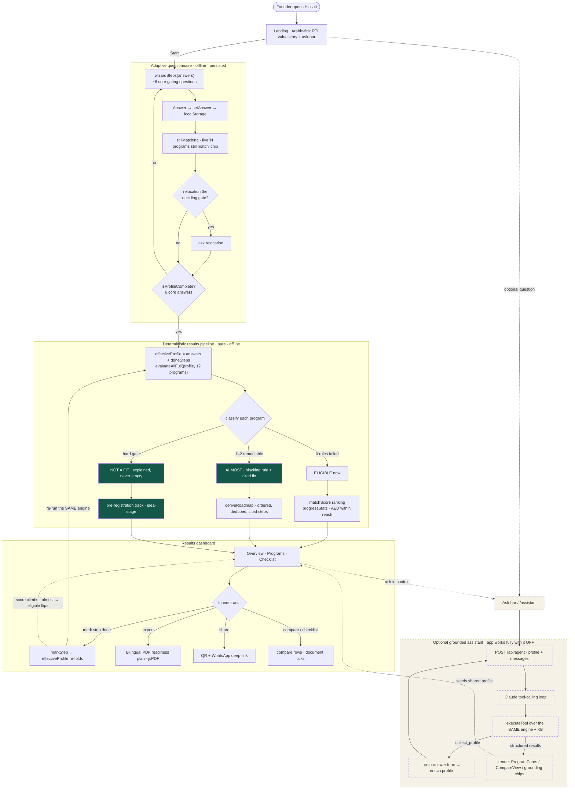
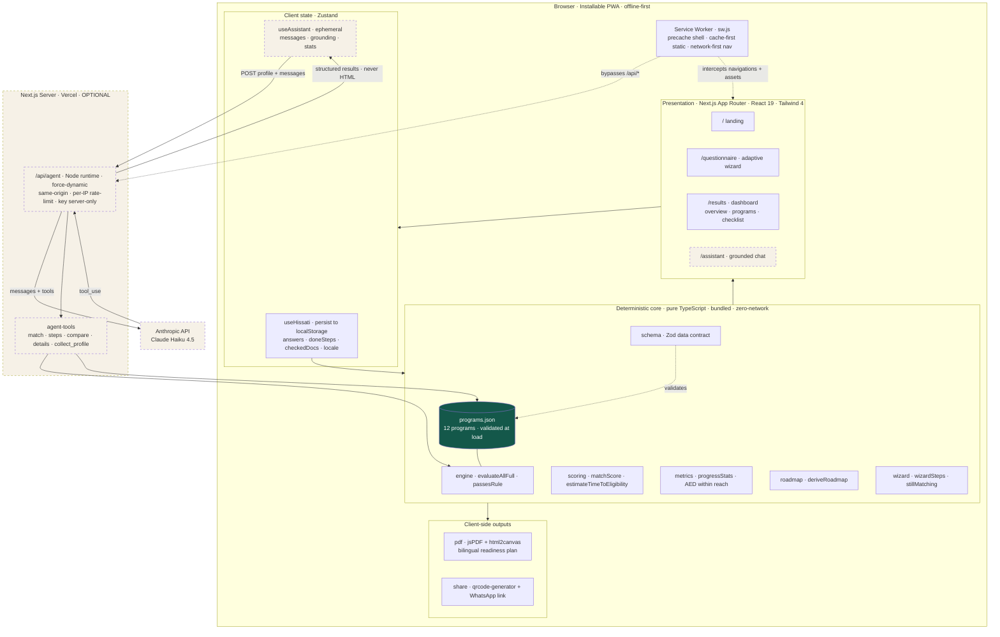
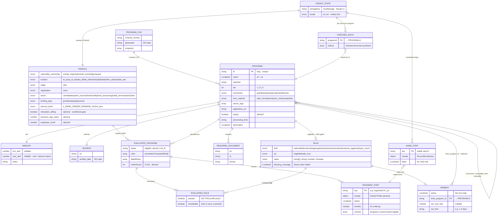

# Hissati · حصتي

**A bilingual, offline-first funding *readiness navigator* for first-time founders in the UAE.**

Hissati (حصتي, *"my share"*) matches a UAE founder to real funding programs and — for the ones they don't yet qualify for — names the **exact blocking rule** and generates the **shortest cited path** to becoming eligible. Every existing tool dead-ends at *"you don't qualify."* Hissati turns that "no" into a sequenced, sourced next step.

🔗 **Live demo:** https://hissati.org  ·  💻 **Repo:** https://github.com/theParitet/TatweerHackathon404Team
🎬 **Demo video:** [`/docs/demo.mp4`](./docs)  ·  🏷️ **Tatweer Hackathon — Challenge 1: Taking the first entrepreneurial step**

---

## 1. The challenge and the problem

**Challenge 1 — Taking the first entrepreneurial step.** Many people in Al Qua'a have a viable idea or a real skill but never start a business. The barrier is rarely ambition — it's not knowing the first move, what's required, or where to begin.

The specific problem we target: **the eligibility wall.** A first-time founder researching funding meets a wall of "you don't qualify" — Khalifa Fund's calculator covers one fund, and everything else is a static list. None of them tells the founder *what to do next*. The information that would actually move them forward (which licence, what it costs, what it unlocks) is scattered, in English, and online-only — which fails a dispersed, weak-connectivity, Arabic-first community.

## 2. Who it's for

Built first for the **Al Qua'a first-time founder** — e.g. an Emirati woman making date products at home, idea-stage, not yet registered. She is the person every existing tool rejects, so for her *the readiness path itself is the value.*

| Persona | Situation | What Hissati gives them |
|---|---|---|
| **New founder** (idea-stage, unregistered) | Rejected by almost every program | The fastest cited path to a first licence, then to first funding — never a zero-results screen |
| **Operating founder** (e.g. 1–2yr camel-dairy) | Seeking expansion funding | Programs they're eligible for now, ranked, with document checklists |
| **Early tech founder** (MVP/traction) | Reaching for the "stretch tier" | Accelerator/competition matches (Hub71, Sheraa, Khalifa Award) with the exact gap to close |
| **Judge / skeptic** | Must verify claims fast | Every figure cited to a primary source with a verified date, checkable from this repo |

## 3. The solution

A short, **Arabic-first (RTL)** questionnaire of ~6 questions feeds a **deterministic matching engine** that classifies every program into one of three buckets and explains itself:

- **Eligible now** — you meet every rule.
- **Almost eligible** — 1–2 *remediable* rules block you; the card shows "You could qualify if…" with the exact missing condition and the next action.
- **Not a fit** — a non-remediable gate, shown in the "why not" explainer rather than padded into results.

From the "almost" set, Hissati builds a **Funding Readiness Roadmap** (ordered, cited steps). The headline metric is a single honest, cited figure — **AED within reach** — that **climbs monotonically** as steps are marked done, while "almost" programs visibly flip to "eligible" in real time. (Every dirham shown is a real, cited `max_aed`, never an estimated weighting.) The output exports as a **downloadable bilingual PDF plan** with per-program document checklists.

**Key characteristics**
- 🛰️ **Offline-first PWA** — the entire wizard → results → roadmap → PDF flow runs in airplane mode. Built for Al Qua'a's connectivity, not a city's.
- 🌐 **Bilingual, Arabic-first** — full RTL with an English toggle; self-hosted Tajawal / Fraunces / IBM Plex Mono fonts (no runtime CDN).
- 📑 **Cited or it doesn't ship** — every AED figure and eligibility rule traces to a primary source with a "verified June 2026" date. Nothing is invented.
- 🤖 **Optional grounded agent** — a Claude-powered chat that turns vague/dialect questions into structured lookups. It calls the *same* engine over the *same* cited data and never emits UI/HTML; the app is fully usable with it switched off.

## 4. How it works

A pure, deterministic pipeline turns the founder's answers into ranked matches, a cited roadmap, and the climbing "AED within reach" figure. Marking a step done re-folds the profile and re-runs the **same** engine — that is the entire live re-check, with no special-casing.



The engine (`evaluateProgram`, `matchScore`, `progressStats`, `estimateTimeToEligibility`, `deriveRoadmap`) is **pure and deterministic** — same inputs always produce the same outputs, with no clock, network, or randomness. That's what makes the demo unbreakable and every claim below reproducible.

## 5. Architecture

Layered, offline-first PWA. The deterministic core and the 12-program knowledge base are bundled into the client, so match → score → roadmap → PDF all run with zero network. A hand-written service worker precaches the app shell and static chunks; the optional `/api/agent` route is the lone server surface (it keeps the Anthropic API key off the client) and is bypassed by the cache.



### Data model (ERD)

There is no SQL database. The data layer is a **bundled JSON knowledge base** (validated against the Zod contract in `schema.ts` at module load) plus **browser `localStorage`** for the founder's own answers and progress. The ERD below is the logical contract: the static, cited KB entities, the entities the engine *derives* at runtime, and the persisted client state.



> All three diagrams — with extended notes and the raw `.mmd` sources — live in **[`docs/DIAGRAMS.md`](./docs/DIAGRAMS.md)** and **[`docs/diagrams/`](./docs/diagrams)**. Each passes `mermaid.parse`.

## 6. Testable claims (verify these from the repo)

Each claim is falsifiable and checkable in minutes — that's criterion 6.

| Claim | How to verify |
|---|---|
| **12 currently-open programs** across 3 tiers (6 / 4 / 2), each linked to a primary source with a verified date | Open [`src/data/programs.json`](./src/data/programs.json); `npm test` → `tests/programs.test.ts` (also Zod-validated at module load) |
| **100% of "not eligible today" profiles return ≥1 actionable, cited step** (the no-dead-ends guarantee) | `npm test` → `tests/engine.test.ts` → *"no-dead-end invariant (FR-C3)"* |
| **AED within reach climbs monotonically `0 → 0 → 2,000,000 → 2,000,000`** for the seeded date-product founder as steps complete | `npm test` → `tests/metrics.test.ts` → *"exact cited values"* |
| **Eligible-program count climbs `0 → 2 → 5 → 6`** along that same path | `npm test` → `tests/metrics.test.ts` |
| **Khalifa Fund loan flips `almost → eligible` exactly at step 2** | `npm test` → `tests/scoring.test.ts` → *"Headline demo beat"* |
| **A new founder reaches a concrete first action in ≤ 3 clicks** | "I only have an idea" → wizard → results with roadmap visible |
| **The full flow runs offline** | DevTools → Network → *Offline* → reload → complete wizard → PDF (see [`docs/07-offline.png`](./docs/07-offline.png)) |
| **Matched result in < 1s on throttled 3G** | DevTools → Network: *Slow 3G* → run the wizard (engine is O(programs × rules), sub-millisecond) |

> **Honesty note (also criterion 6):** Of the 12 programs, the directly-quantified funding figures are Khalifa Fund SME (up to **AED 2M**, loan) and Hub71 Access (up to **AED 500K**, *in-kind* package), plus the licence-rung costs (Tajer ~AED 790; permits in the AED 0–1,000 band). Grant and VC amounts that are **not publicly fixed** (Ma'an, ADDED, Access Sharjah, Khalifa Award, the VCs) contribute `0` to "AED within reach" and flip an "amounts vary" flag rather than being invented, and the Arabic copy is marked **draft pending native review**. We'd rather under-claim and be verifiable than inflate a headline.

## 7. Tech stack

**Next.js 16 (App Router) · React 19 · TypeScript 5 · Tailwind CSS 4 · Zustand 5 (+persist) · Zod 3 · Vitest 2 · Vercel · Anthropic Claude (optional agent).**

Supporting libraries: **jsPDF + html2canvas** (client-side bilingual PDF), **qrcode-generator** (offline QR), **react-markdown + remark-gfm** (assistant rendering), **lucide-react** (icons), and self-hosted **Tajawal / Fraunces / IBM Plex Mono** via `next/font`.

The deterministic core is plain TypeScript with no heavy dependencies, and the knowledge base ships in the bundle so matching needs zero network. Offline is a **hand-written service worker** (`public/sw.js`) — Next 16's Turbopack doesn't run the webpack hook that `next-pwa`/Serwist rely on — and the UI is built on **bespoke primitives** (`components/ui.tsx`), not a component library. The only server-side surface is an optional `/api/agent` route that keeps the API key off the client and returns structured results only (never HTML). Full layering, data flows, and the service-worker strategy are in [`docs/DIAGRAMS.md`](./docs/DIAGRAMS.md).

## 8. Run it locally

```bash
npm install
npm test               # Vitest: engine, scoring, metrics, programs, compare, checklist, completeness, format
npm run dev            # http://localhost:3000
npm run build && npm start
```

The agent is **optional**. Without `ANTHROPIC_API_KEY` the `/api/agent` route reports `enabled: false` and the assistant UI hides itself — the deterministic app is unchanged. To enable it locally, add a `.env.local` with `ANTHROPIC_API_KEY=sk-ant-...`.

**Verify offline (the headline claim):**
```
1. npm run build && npm start
2. Load the app once — the service worker precaches the shell, KB, and fonts
3. DevTools → Network → Offline
4. Reload — the app loads fully from cache
5. Run the whole wizard → results → roadmap → PDF flow with no network
```

## 9. Data & citations

The knowledge base is **hand-verified**, not scraped. Each of the 12 records in [`src/data/programs.json`](./src/data/programs.json) carries bilingual names, operator, tier, instrument, a structured amount, eligibility rules (each with a bilingual blocking message and an optional cited remedy), required documents, an application URL, and a **`source.url` + `verified_date`** (all `2026-06-26`). The dataset is validated against [`src/lib/schema.ts`](./src/lib/schema.ts) at module load and in `tests/programs.test.ts`, so a malformed record fails the build instead of shipping. Amounts that could not be live-confirmed against JavaScript-rendered government portals are left unfixed (they contribute `0` to "AED within reach" rather than an invented figure), and Arabic strings are drafted and flagged for native review before any public launch.

## 10. Documentation

| Reference | Covers |
|---|---|
| [`docs/DIAGRAMS.md`](./docs/DIAGRAMS.md) | The three architecture diagrams — system, data model (ERD), functionality workflow — with notes |
| [`docs/diagrams/`](./docs/diagrams) | Raw, `mermaid.parse`-validated diagram sources |
| [`CLAUDE.md`](./CLAUDE.md) | Engineering ground rules, module map, and the frozen data-contract invariants |
| [`docs/screenshots/`](./docs/screenshots) · [`docs/`](./docs) | UI screenshots and two sample bilingual PDF plans |

**Core invariants (true across the codebase)**
1. **Deterministic core** — pure functions; same inputs → same outputs (NFR-7).
2. **Three buckets only** — `eligible` (0 failed rules) · `almost` (≤2 failed, all remediable) · `not_fit` (FR-C1).
3. **No dead ends** — every `almost` carries 1–2 cited steps; idea-stage founders always see a pre-registration path (FR-C3 / FR-G).
4. **Offline-first** — the whole core flow runs in airplane mode; the only egress is the optional `/api/agent` route (NFR-1).
5. **Cited or it doesn't ship** — every figure and rule traces to a primary source with a verified date (FR-B2).
6. **Frozen vocabulary** — enum values and field names are referenced verbatim across dataset, scoring, and engine; additive changes only.

---

## Team & license

Built for the **Tatweer Hackathon** (26–28 June 2026, Al Qua'a · in collaboration with Abu Dhabi University). Open-sourced per the hackathon's rural-infrastructure track so other communities can adapt the data and the engine.

*Hissati is an information tool, not a licensed financial or legal advisor. It surfaces public funding programs and their stated rules; it does not file applications on anyone's behalf.*
