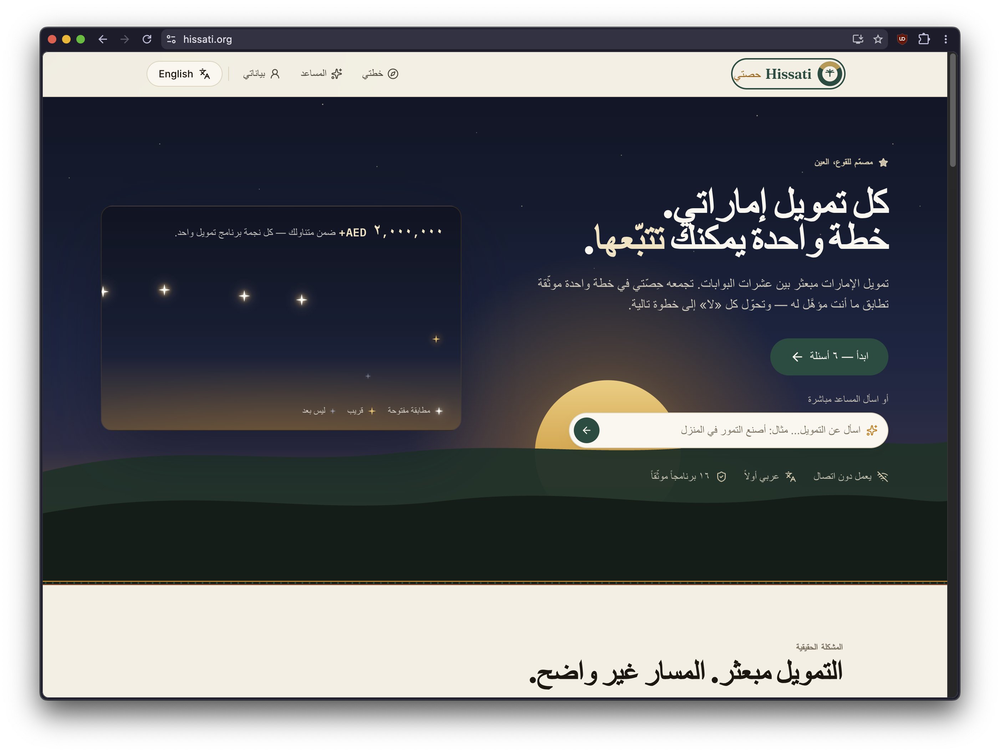
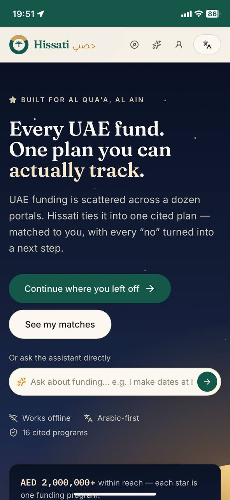
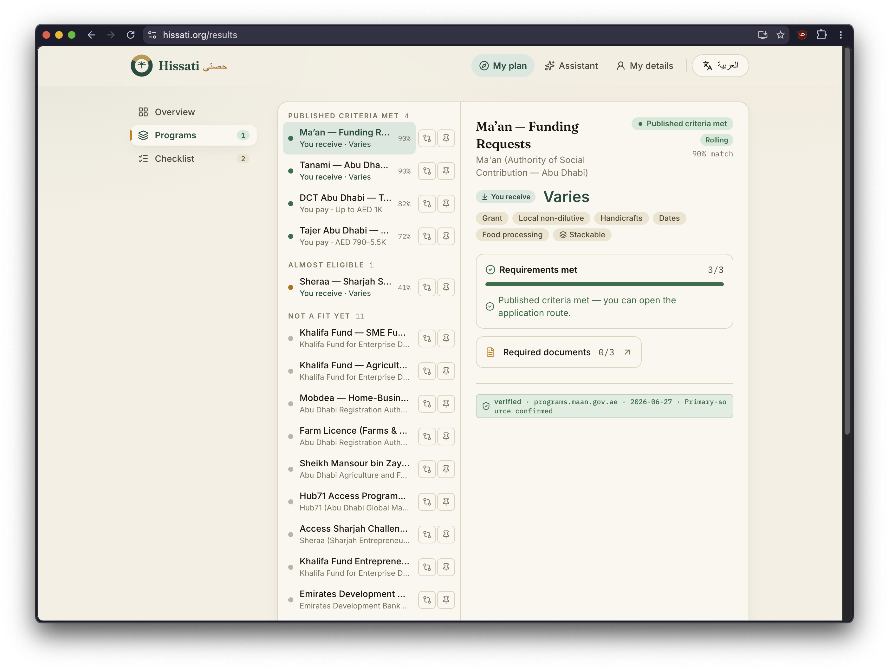
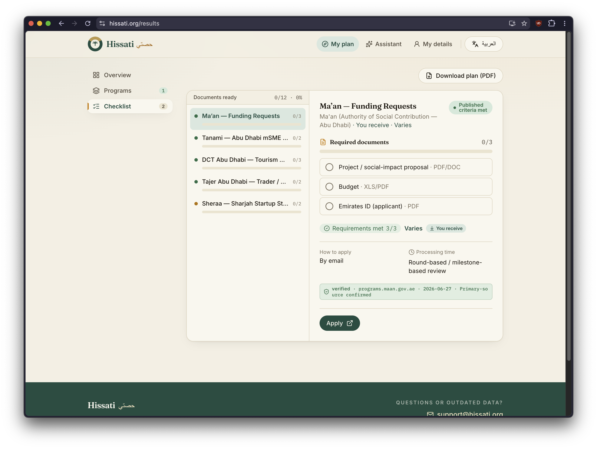
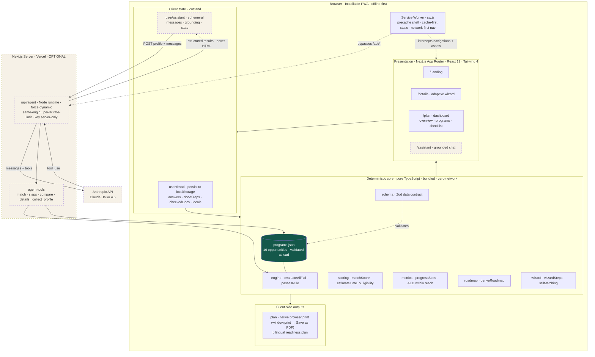

<div align="center">


# Hissati · حصتي

**A bilingual, offline-first funding *readiness navigator* for first-time founders in the UAE.**

[](./LICENSE) [](https://nextjs.org)  [](https://hissati.org)

**Tatweer Hackathon — Challenge 1: Taking the first entrepreneurial step**

</div>

Hissati (حصتي, *"my share"*) matches a UAE founder to real funding programs and — for the ones they don't yet qualify for — names the **exact blocking rule** and generates the **shortest cited path** to becoming eligible. Where existing tools dead-end at *"you don't qualify,"* Hissati sequences that "no" into a sourced next step.

<table>
  <tr>
    <td width="72%"></td>
    <td width="28%"></td>
  </tr>
  <tr>
    <td align="center"><sub>Arabic-first desktop experience</sub></td>
    <td align="center"><sub>Responsive mobile experience</sub></td>
  </tr>
</table>

---

## 1. The problem

**Challenge 1 — Taking the first entrepreneurial step.** Many people in Al Qua'a have a viable idea or a real skill but never start a business. The barrier is rarely ambition — it's not knowing the first move, what's required, or where to begin.

The specific wall we target is **eligibility**. A first-time founder researching funding meets a wall of "you don't qualify": Khalifa Fund's calculator covers one fund, everything else is a static list, and none of them says *what to do next*. The information that would actually move a founder forward — which licence, what it costs, what it unlocks — is scattered, in English, and online-only, which fails a dispersed, weak-connectivity, Arabic-first community.

The need is documented:

- SMEs are **94%+ of all UAE companies**, around 86% of the private-sector workforce and roughly 63.5% of non-oil GDP — about 557,000 today, targeted to reach one million by 2030 [[1]](#references).
- Yet only about **a quarter to 28%** of UAE SMEs have ever secured bank financing [[2]](#references)[[3]](#references), and the GCC SME credit gap sits near US$250 billion [[3]](#references). Government programmes help, but are fragmented across federal, emirate-level and specialised entities — each with different criteria and portals — so qualified founders never find the one built for their stage, sector, or location [[4]](#references).
- The wall hits hardest in rural, Arabic-speaking communities. Al Ain is the UAE's agricultural heartland — its UNESCO-listed oasis alone holds 147,000+ date palms [[8]](#references) — and home to the country's first dairy and only camel-milk producer [[9]](#references), in a nation that imports most of its food [[10]](#references). A characteristic founder here is an Emirati woman making date products at home: idea-stage, unregistered, rejected by almost every calculator she opens. Women are about **18% of UAE entrepreneurs** [[5]](#references); access to finance (38.8%) is among their most-cited obstacles [[6]](#references), and 67% name funding as a primary challenge [[7]](#references). For her, the readiness path itself is the value.

## 2. Who it's for

Built first for the **Al Qua'a first-time founder** — idea-stage, not yet registered, the person every existing tool rejects.

| Persona | Situation | What Hissati gives them |
|---|---|---|
| **New founder** (idea-stage, unregistered) | Rejected by almost every program | The fastest cited path to a first licence, then to first funding — never a zero-results screen |
| **Operating founder** (e.g. 1–2yr camel-dairy) | Seeking expansion funding | Programs they're eligible for now, ranked, with document checklists |
| **Early tech founder** (MVP/traction) | Reaching for the "stretch tier" | Accelerator/competition matches (Hub71, Sheraa, Khalifa Award) with the exact gap to close |
| **Reviewer / verifier** | Wants to check claims independently | Every program record carries source provenance, a verified date, and a confidence level, checkable from this repo |

## 3. The solution

A short, **Arabic-first (RTL)** questionnaire of ~6 questions feeds a **deterministic matching engine** that sorts every program into one of three buckets and explains itself:

- **Eligible now** — you meet every rule.
- **Almost eligible** — 1–2 *remediable* rules block you; the card shows "You could qualify if…" with the exact missing condition and the next action.
- **Not a fit** — a non-remediable gate, shown in a "why not" explainer rather than padded into results.

From the "almost" set, Hissati builds a **Funding Readiness Roadmap** of ordered, cited steps. The headline metric is a single honest, cited figure — **AED within reach** — that **climbs monotonically** as steps are marked done, while "almost" programs visibly flip to "eligible" in real time. The output exports as a **downloadable bilingual PDF plan** with per-program document checklists.

**Key characteristics**

- **Offline-first PWA** — the entire wizard → results → roadmap → PDF flow runs in airplane mode. Built for Al Qua'a's connectivity.
- **Bilingual, Arabic-first** — full RTL with an English toggle; self-hosted Tajawal / Fraunces / IBM Plex Mono fonts (no runtime CDN).
- **Cited evidence** — every program amount and eligibility rule carries source provenance, a verification date, and an explicit confidence level.
- **Optional grounded agent** — a Claude-powered chat that turns vague or dialect questions into structured lookups over the *same* engine and *same* cited data; it never emits UI/HTML, and the app is fully usable with it switched off.

<table>
  <tr>
    <td width="50%"></td>
    <td width="50%"></td>
  </tr>
  <tr>
    <td align="center"><sub>Explainable matches with source provenance</sub></td>
    <td align="center"><sub>Program-specific checklist and PDF plan</sub></td>
  </tr>
</table>

## 4. How it works

A pure, deterministic pipeline turns the founder's answers into ranked matches, a cited roadmap, and the climbing "AED within reach" figure. Marking a step done re-folds the profile and re-runs the **same** engine — that is the entire live re-check, with no special-casing, no clock, no network, and no randomness, so every claim in §7 is reproducible.


## 5. Architecture

Layered, offline-first PWA. The deterministic core and the 16-opportunity knowledge base are bundled into the client, so match → score → roadmap → PDF all run with zero network. A hand-written service worker precaches the app shell and static chunks; the optional `/api/agent` route is the lone server surface (it keeps the Anthropic API key off the client) and is bypassed by the cache.



### Data model

There is no SQL database: the data layer is the bundled JSON knowledge base (validated against the Zod contract in `schema.ts` at module load) plus browser `localStorage` for the founder's own answers and progress. The full entity-relationship diagram — with notes and raw, `mermaid.parse`-validated `.mmd` sources — lives in [`docs/DIAGRAMS.md`](./docs/DIAGRAMS.md) and [`docs/diagrams/`](./docs/diagrams).

### Feasibility & operations

Hissati is software-only and deploys on free-tier Vercel with no servers to operate; because the core flow needs no backend, fixed cost is effectively zero, and the only variable cost is the optional assistant (bounded by a same-origin check, a per-IP rate limit, and an API-key spend cap). Eligibility is **data, not code** — every rule lives in [`src/data/programs.json`](./src/data/programs.json) with a `source.url` and `verified_date`, so adding a programme or an emirate is a schema-checked data edit and staleness is auditable rather than silent. The app stores no personal data server-side (answers live only in `localStorage`), so there is no database to secure and no PII to govern. This fits how the UAE goes online — 99% internet penetration, mobile-dominant, with 11.9% of people in rural areas [[11]](#references) — where an installable, offline-first PWA still finishes the wizard or pulls up a checklist when coverage drops. The same build replicates to any community or emirate by editing the knowledge base.

## 6. Tech stack

**Next.js 16 (App Router) · React 19 · TypeScript 5 · Tailwind CSS 4 · Zustand 5 (+persist) · Zod 3 · Vitest 2 · Vercel · Anthropic Claude (optional agent).**

Supporting libraries: `react-markdown` + `remark-gfm` (assistant rendering), `lucide-react` (icons), and self-hosted Tajawal / Fraunces / IBM Plex Mono via `next/font`. The bilingual PDF plan is produced by **native browser print** (`window.print()` → Save as PDF) — no client-side PDF/rasteriser dependency. Offline is a **hand-written service worker** (`public/sw.js`), because Next 16's Turbopack doesn't run the webpack hook that `next-pwa`/Serwist rely on; the UI is built on bespoke primitives (`components/ui.tsx`), not a component library. The deterministic core is plain TypeScript with the knowledge base shipped in the bundle, so matching needs zero network.

## 7. Verify it yourself

Each claim is falsifiable and checkable in minutes.

| Claim | How to verify |
|---|---|
| **16 tracked opportunities** across 3 tiers (10 / 4 / 2), each carrying availability metadata and a source verification date | Open [`src/data/programs.json`](./src/data/programs.json); `npm test` → `tests/programs.test.ts` (also Zod-validated at module load) |
| **Every "almost" match for the seeded date-product founder has 1–2 blocking rules, all with actionable remedies** | `npm test` → `tests/engine.test.ts` → the no-dead-end invariant |
| **AED within reach climbs monotonically `0 → 0 → 2,000,000 → 7,000,000`** for the seeded date-product founder as steps complete | `npm test` → `tests/metrics.test.ts` → *"exact cited values"* |
| **Open-match count climbs `0 → 1 → 3 → 4`** along that same path | `npm test` → `tests/metrics.test.ts` |
| **Khalifa Fund loan flips `almost → eligible` exactly at step 2** | `npm test` → `tests/scoring.test.ts` (step-2 eligibility flip) |
| **A new founder reaches a concrete first action in ≤ 3 clicks** | "I only have an idea" → wizard → results with roadmap visible |
| **The full flow runs offline** | DevTools → Network → *Offline* → reload → complete wizard → PDF |
| **Matched result in < 1s on throttled 3G** | DevTools → Network: *Slow 3G* → run the wizard (engine is O(programs × rules), sub-millisecond) |

> **Honesty note:** Of the 16 tracked opportunities, the headline metric uses only conservative, per-applicant figures that are both countable and currently available: Khalifa Fund financing up to **AED 2M** (its SME and agricultural alternatives are grouped to prevent double-counting), EDB AgriTech financing up to **AED 5M**, and the initial **AED 250K cash** component of Hub71 Access. Closed opportunities, collective prize pools, in-kind support, services, licence costs, and programs without a published ceiling contribute `0` rather than being presented as reachable cash. The Arabic copy is marked draft pending native review.

## 8. Run it locally

```bash
npm install
npm test               # Vitest: engine, scoring, metrics, programs, compare, checklist, completeness, format
npm run dev            # http://localhost:3000
npm run build && npm start
```

The agent is **optional**. Without `ANTHROPIC_API_KEY` the `/api/agent` route reports `enabled: false` and the assistant UI hides itself — the deterministic app is unchanged. To enable it locally, add a `.env.local` with `ANTHROPIC_API_KEY=sk-ant-...`.

**Verify offline (the headline claim):** `npm run build && npm start`, load the app once (the service worker precaches the shell, KB, and fonts), then DevTools → Network → *Offline* and reload — the whole wizard → results → roadmap → PDF flow runs with no network.

## 9. Data & documentation

The knowledge base is **hand-verified, not scraped**. Each of the 16 records in [`src/data/programs.json`](./src/data/programs.json) carries bilingual names, operator, tier, instrument, structured amount semantics, availability status, eligibility rules (each with a bilingual blocking message and an optional cited remedy), required documents, an application URL, and source provenance — all with a `verified_date` and `availability.checked_date` in **late June 2026** (most `2026-06-27`, two refreshed `2026-06-29`). The dataset is validated against [`src/lib/schema.ts`](./src/lib/schema.ts) at module load and in `tests/programs.test.ts`, so a malformed record fails the build instead of shipping. Closed opportunities, non-cash value, costs, and amounts without a defensible per-applicant ceiling are excluded from "AED within reach", and Arabic strings are flagged for native review before any public launch.

| Reference | Covers |
|---|---|
| [`docs/DIAGRAMS.md`](./docs/DIAGRAMS.md) | The three architecture diagrams — system, data model (ERD), functionality workflow — with notes |
| [`docs/diagrams/`](./docs/diagrams) | Raw, `mermaid.parse`-validated diagram sources |
| [`CLAUDE.md`](./CLAUDE.md) | Engineering ground rules, module map, and the frozen data-contract invariants |
| [`docs/screenshots/`](./docs/screenshots) | UI screenshots of the live app |

## References

Context and feasibility figures in §1 and §5 are drawn from the following primary and authoritative secondary sources (accessed June 2026):

1. UAE Government Portal (u.ae) — *Small and Medium Enterprises*. https://u.ae/en/information-and-services/business/small-and-medium-enterprises
2. Ken Research — *UAE SME Financing Market Size, Share, Growth Opportunities 2030* (citing Central Bank of the UAE). https://www.kenresearch.com/uae-sme-financing-market
3. Channel Capital Advisors LLP — *The $250 Billion Opportunity: Closing the GCC's SME Financing Gap* (citing IFC, AT Kearney, SAMA and CBUAE data). https://channelcapital.io/the-gccs-sme-financing-gap/
4. Jazaa — *A Complete Guide to Government Grants for SMEs in the UAE 2026*. https://jazaa.com/blog/guide-to-government-grants-for-smes/
5. Khaleej Times / Sovereign — *Women account for 18% of all UAE-based entrepreneurs* (Khalifa Fund women support; National Policy for Empowerment of Emirati Women 2023–2031). https://www.khaleejtimes.com/business/women-account-for-18-of-all-uae-based-entrepreneurs
6. The National — *Female Emirati entrepreneurs' businesses are booming, survey finds* (Nama Women Advancement report, 2022). https://www.thenationalnews.com/uae/government/2022/12/22/female-emirati-entrepreneurs-businesses-are-booming-survey-finds/
7. Venture Pulse — *Women Entrepreneurship in the UAE: A Flourishing Ecosystem* (citing Mastercard and GEM data). https://www.venturepulsemag.com/2025/04/29/women-entrepreneurship-in-the-uae-a-flourishing-ecosystem/
8. The National — *Tour of Al Ain Oasis date farm shines spotlight on traditional farming methods* (UNESCO World Heritage oasis, 147,000+ date palms). https://www.thenationalnews.com/arts/tour-of-al-ain-oasis-date-farm-shines-spotlight-on-traditional-farming-methods-1.921758
9. Al Ain Farms — *About / Company history* (first UAE dairy, 1981; camel-milk producer). https://alainfarms.com/
10. Wikipedia — *Agriculture in the United Arab Emirates* (food-import dependence; UAE date production). https://en.wikipedia.org/wiki/Agriculture_in_the_United_Arab_Emirates
11. DataReportal (Meltwater & We Are Social) — *Digital 2025: The United Arab Emirates* (99% internet penetration; urban/rural split). https://datareportal.com/reports/digital-2025-united-arab-emirates

> Figures are cited as reported by each source and were current at the time of access. Where independent estimates differ (e.g. the share of SMEs that access bank finance), the README states the range rather than a single number.

---

## Project, license & disclaimer

Built for the **Tatweer Hackathon** (26–28 June 2026, Al Qua'a · in collaboration with Abu Dhabi University). Released under the [`MIT License`](./LICENSE).

> **Hackathon submission:** the project as judged is at commit [`2954a34`](https://github.com/theParitet/TatweerHackathon404Team/tree/2954a34). Later commits are post-hackathon.

*Hissati is an information tool, not a licensed financial or legal advisor. It surfaces public funding programs and their stated rules; it does not file applications on anyone's behalf.*
