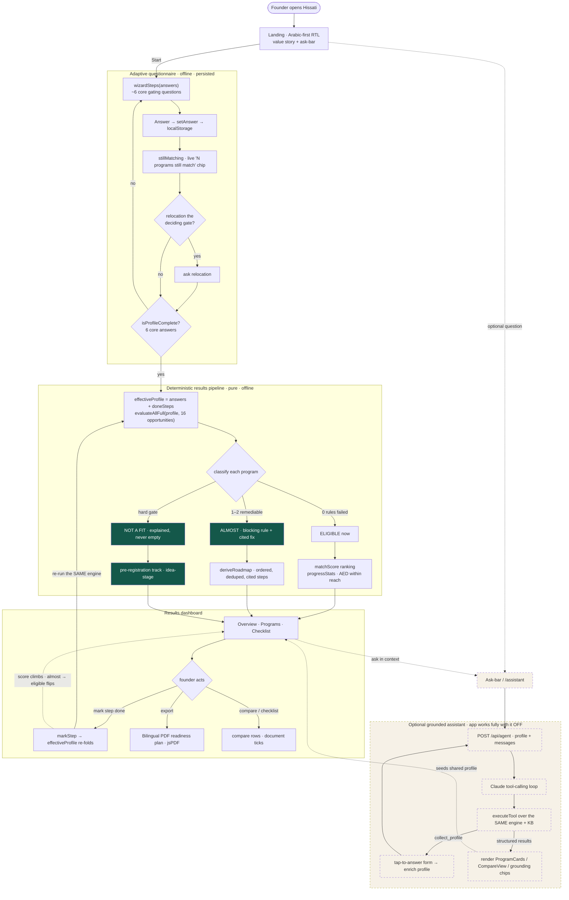
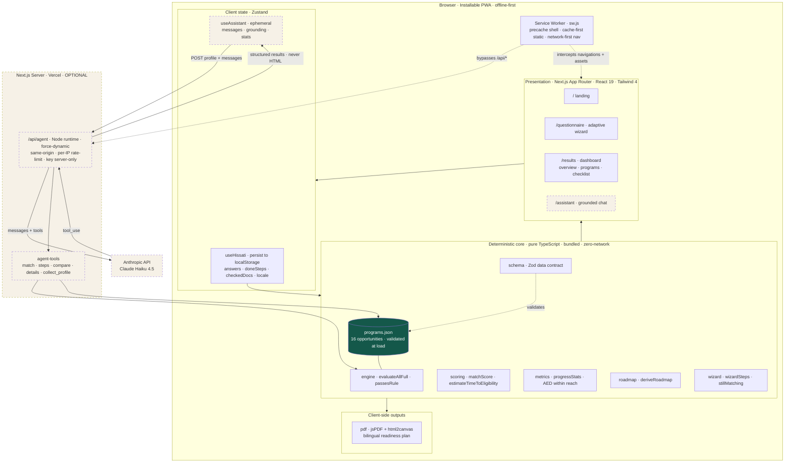

# Hissati · حصتي

**A bilingual, offline-first funding *readiness navigator* for first-time founders in the UAE.**

Hissati (حصتي, *"my share"*) matches a UAE founder to real funding programs and — for the ones they don't yet qualify for — names the **exact blocking rule** and generates the **shortest cited path** to becoming eligible. Every existing tool dead-ends at *"you don't qualify."* Hissati turns that "no" into a sequenced, sourced next step.

🔗 **Live demo:** https://hissati.org  ·  💻 **Repo:** https://github.com/theParitet/TatweerHackathon404Team
🏷️ **Tatweer Hackathon — Challenge 1: Taking the first entrepreneurial step**

<table>
  <tr>
    <td width="72%"></td>
    <td width="28%"></td>
  </tr>
  <tr>
    <td align="center"><sub>Arabic-first desktop experience</sub></td>
    <td align="center"><sub>Responsive mobile experience</sub></td>
  </tr>
</table>

---

## 1. The challenge and the problem

**Challenge 1 — Taking the first entrepreneurial step.** Many people in Al Qua'a have a viable idea or a real skill but never start a business. The barrier is rarely ambition — it's not knowing the first move, what's required, or where to begin.

The specific problem we target: **the eligibility wall.** A first-time founder researching funding meets a wall of "you don't qualify" — Khalifa Fund's calculator covers one fund, and everything else is a static list. None of them tells the founder *what to do next*. The information that would actually move them forward (which licence, what it costs, what it unlocks) is scattered, in English, and online-only — which fails a dispersed, weak-connectivity, Arabic-first community.

## 2. Who it's for

Built first for the **Al Qua'a first-time founder** — e.g. an Emirati woman making date products at home, idea-stage, not yet registered. She is the person every existing tool rejects, so for her *the readiness path itself is the value.*

| Persona | Situation | What Hissati gives them |
|---|---|---|
| **New founder** (idea-stage, unregistered) | Rejected by almost every program | The fastest cited path to a first licence, then to first funding — never a zero-results screen |
| **Operating founder** (e.g. 1–2yr camel-dairy) | Seeking expansion funding | Programs they're eligible for now, ranked, with document checklists |
| **Early tech founder** (MVP/traction) | Reaching for the "stretch tier" | Accelerator/competition matches (Hub71, Sheraa, Khalifa Award) with the exact gap to close |
| **Judge / skeptic** | Must verify claims fast | Every program record carries source provenance, a verified date, and a confidence level, checkable from this repo |

## 3. The situation and the problem — in numbers

The founders furthest from capital in the UAE are precisely those in rural, Arabic-speaking communities like Al Qua'a. The case for Hissati rests on three documented realities — a sector that needs capital, a wall that keeps it out, and a target demographic the wall hits hardest.

**The sector that needs capital.** Small and medium enterprises make up **more than 94%** of all companies in the UAE, employ around **86%** of the private-sector workforce, and contribute roughly **63.5% of non-oil GDP**; there were about **557,000 SMEs** by mid-2022, with the government targeting **one million by 2030** [[1]](#references). The sector is regulated and promoted under Federal Law No. 2 of 2014 [[1]](#references). In other words, the country's economic engine is built from exactly the kind of small founder Hissati serves.

**The eligibility wall.** Despite that centrality, access to finance is the sector's defining constraint. By various estimates only about **a quarter to 28%** of UAE SMEs have ever secured bank financing [[2]](#references)[[3]](#references); SME lending stood at roughly **AED 81.7 billion — about 9.7%** of banks' trade-and-industrial facilities at the end of Q1 2024 [[4]](#references). Across the GCC the SME credit gap is estimated at about **US$250 billion** and has barely moved in a decade [[3]](#references). Banks typically demand **200–250% collateral** for an SME loan (versus ~140% for corporates) and take **8–12 weeks** to approve one [[3]](#references). Government programmes help, but carry **limited, often nationality- or emirate-bound eligibility** [[5]](#references). And the support that exists is **fragmented** — multiple federal, emirate-level and specialised entities, each with different criteria and application portals, so that many qualified founders never discover the programme built for their stage, sector, or location [[6]](#references). About **42%** of UAE SMEs also report inadequate financial literacy to navigate these options [[2]](#references). This is the wall Hissati attacks: not a shortage of programmes, but the absence of anything that tells a first-time founder *which one fits and what to do next.*

**The target demographic and their situation.** Hissati is built first for the Al Qua'a / Al Ain first-time founder. Al Ain is the UAE's agricultural heartland — its UNESCO-listed oasis alone holds more than **147,000 date palms** tended by families across generations [[11]](#references) — and home to the country's first dairy and only camel-milk producer [[12]](#references), in a nation that still **imports the overwhelming majority of its food** [[13]](#references). A characteristic founder here is an Emirati woman making date products or handicrafts at home: idea-stage, not yet registered, and rejected by almost every funding calculator she opens. The data shows she is far from alone — women are about **18% of UAE entrepreneurs** (77.6% of them under 40) [[7]](#references), and a 2021 report counted roughly **25,000 Emirati women owning ~50,000 businesses worth about AED 60 billion**, of which **72% are microenterprises** [[8]](#references). Their two most-cited obstacles are **access to markets (41.2%)** and **access to finance (38.8%)** [[8]](#references); **67%** name funding as a primary challenge, and women are three times likelier than men to cite a confidence gap [[9]](#references). The UAE actively backs this group — it scores **highest in the world for social support to women entrepreneurs** [[10]](#references), and Khalifa Fund initiatives such as **Sougha** and **Al Mubdi'ah** exist specifically to help Emirati women artisans turn heritage crafts into businesses [[7]](#references) — yet these are exactly the programmes a founder cannot find or sequence on her own. **For her, the readiness path itself is the product.**

## 4. The solution

A short, **Arabic-first (RTL)** questionnaire of ~6 questions feeds a **deterministic matching engine** that classifies every program into one of three buckets and explains itself:

- **Eligible now** — you meet every rule.
- **Almost eligible** — 1–2 *remediable* rules block you; the card shows "You could qualify if…" with the exact missing condition and the next action.
- **Not a fit** — a non-remediable gate, shown in the "why not" explainer rather than padded into results.

From the "almost" set, Hissati builds a **Funding Readiness Roadmap** (ordered, cited steps). The headline metric is a single honest, cited figure — **AED within reach** — that **climbs monotonically** as steps are marked done, while "almost" programs visibly flip to "eligible" in real time. (Every dirham shown comes from a conservative, cited `countable_max_aed`, never an estimated weighting.) The output exports as a **downloadable bilingual PDF plan** with per-program document checklists.

**Key characteristics**
- 🛰️ **Offline-first PWA** — the entire wizard → results → roadmap → PDF flow runs in airplane mode. Built for Al Qua'a's connectivity, not a city's.
- 🌐 **Bilingual, Arabic-first** — full RTL with an English toggle; self-hosted Tajawal / Fraunces / IBM Plex Mono fonts (no runtime CDN).
- 📑 **Cited or it doesn't ship** — every program amount and eligibility rule carries source provenance, a verification date, and an explicit confidence level. Nothing is invented.
- 🤖 **Optional grounded agent** — a Claude-powered chat that turns vague/dialect questions into structured lookups. It calls the *same* engine over the *same* cited data and never emits UI/HTML; the app is fully usable with it switched off.

<table>
  <tr>
    <td width="50%"></td>
    <td width="50%"></td>
  </tr>
  <tr>
    <td align="center"><sub>Explainable matches with source provenance</sub></td>
    <td align="center"><sub>Program-specific checklist and PDF plan</sub></td>
  </tr>
</table>

## 5. How it works

A pure, deterministic pipeline turns the founder's answers into ranked matches, a cited roadmap, and the climbing "AED within reach" figure. Marking a step done re-folds the profile and re-runs the **same** engine — that is the entire live re-check, with no special-casing.



The engine (`evaluateProgram`, `matchScore`, `progressStats`, `estimateTimeToEligibility`, `deriveRoadmap`) is **pure and deterministic** — same inputs always produce the same outputs, with no clock, network, or randomness. That's what makes the demo unbreakable and every claim below reproducible.

## 6. Architecture

Layered, offline-first PWA. The deterministic core and the 16-opportunity knowledge base are bundled into the client, so match → score → roadmap → PDF all run with zero network. A hand-written service worker precaches the app shell and static chunks; the optional `/api/agent` route is the lone server surface (it keeps the Anthropic API key off the client) and is bypassed by the cache.



### Data model (ERD)

There is no SQL database. The data layer is a **bundled JSON knowledge base** (validated against the Zod contract in `schema.ts` at module load) plus **browser `localStorage`** for the founder's own answers and progress. The ERD below is the logical contract: the static, cited KB entities, the entities the engine *derives* at runtime, and the persisted client state.

```mermaid
erDiagram
  PROGRAM_FILE ||--o{ PROGRAM : "contains (16)"
  PROGRAM ||--|| AMOUNT : has
  PROGRAM ||--|| AVAILABILITY : "status checked"
  PROGRAM ||--|| SOURCE : "cited by"
  PROGRAM ||--|{ RULE : "eligibility · AND-gates"
  PROGRAM ||--o{ REQUIRED_DOCUMENT : requires
  RULE ||--o| REMEDY : "may carry"
  REMEDY }o--o| PROGRAM : "links_program_id · unblocks"
  PROGRAM }o--o{ PROGRAM : "concurrent_compatible_with · stackable"

  PROFILE ||--o{ EVALUATED_PROGRAM : "engine yields"
  PROGRAM ||--o{ EVALUATED_PROGRAM : "classified as"
  EVALUATED_PROGRAM ||--|{ EVALUATED_RULE : annotates
  RULE ||--o{ EVALUATED_RULE : "+ passed flag"
  EVALUATED_PROGRAM ||--o{ ROADMAP_STEP : "almost → steps"

  HISSATI_STATE ||--|| PROFILE : "answers (Partial)"
  HISSATI_STATE ||--o{ DONE_STEP : "completed steps"
  HISSATI_STATE ||--o{ CHECKED_DOCS : "doc ticks per program"
  DONE_STEP }o--|| ROADMAP_STEP : "marks done"
  CHECKED_DOCS }o--|| PROGRAM : "keyed by id"

  PROGRAM_FILE {
    string schema_version
    string generated "ISO date"
    array  programs
  }
  PROGRAM {
    string id PK "slug · unique"
    Localized name "en + ar"
    string operator
    int    tier "1 | 2 | 3"
    enum   instrument "grant|loan|equity|accelerator|license|support"
    enum   intro_method "open_form|tamm|warm_intro|competition|email"
    array  sector_tags
    string application_url
    boolean equity "dilutive?"
    string funding_group "optional · prevents double-counting"
    string processing_time
    Localized description
  }
  AMOUNT {
    number min_aed "nullable"
    number max_aed "nullable · null = amount varies"
    number countable_max_aed "nullable · headline metric"
    enum   value_kind "finance|cash|cash_and_in_kind|in_kind|prize_pool|service|cost|variable"
    string notes
  }
  AVAILABILITY {
    enum   status "rolling|open|closed|unknown"
    string checked_date "ISO date"
    string opens "optional"
    string closes "optional"
    string next_cycle "optional"
  }
  SOURCE {
    string url
    string verified_date "ISO date"
    enum   confidence "confirmed|reported|estimated"
    string method
  }
  RULE {
    enum   field "nationality_ownership|location|stage|registration|sector|relocation_willing|business_age|employee_count|gender|farm_tenure|social_impact"
    enum   op "in|gte|lte|eq|is_true"
    union  value "string[] | string | number | boolean"
    Localized blocking_message "shown when failed"
  }
  REMEDY {
    Localized action "the next step"
    string links_program_id FK "→ PROGRAM.id"
    number est_cost_aed "nullable"
    string est_time "e.g. 1-3 days"
  }
  REQUIRED_DOCUMENT {
    string en
    string ar
    string format
  }
  PROFILE {
    enum   nationality_ownership "emirati_majority|emirati_minority|gcc|expat"
    enum   location "al_quaa_al_ain|abu_dhabi_other|sharjah|dubai|other_uae|outside_uae"
    enum   stage "idea<mvp<early_traction<established"
    enum   registration "none<lt_1yr<reg_1_2yr<reg_2yr_plus"
    enum   sector "camel|dates|astro_tourism|handicrafts|food_processing|retail_services|tech|other"
    enum   funding_type "grant|loan|equity|unsure"
    enum   amount_band "lt_50k|50_200k|200_500k|500k_2m|2m_plus"
    boolean relocation_willing "optional · conditional gate"
    enum   gender "female|male · optional"
    boolean farm_tenure "optional"
    boolean social_impact "optional"
    number business_age_years "optional"
    number employee_count "optional"
    enum   team "solo|cofounder|technical_cofounder · optional"
    boolean has_pitch_deck "optional"
    boolean has_financials "optional"
  }
  EVALUATED_PROGRAM {
    string status "eligible | almost | not_fit"
    array  rules "annotated EvaluatedRule[]"
    array  failedRules
    int    matchScore "0-100 · derived"
  }
  EVALUATED_RULE {
    boolean passed "did THIS profile pass?"
    boolean remediable "does it carry a remedy?"
  }
  ROADMAP_STEP {
    string key PK "e.g. registration:lt_1yr"
    object mutate "Partial Profile advance"
    Localized action
    number months "for ordering"
    array  unlocks "programs moved toward eligible"
  }
  HISSATI_STATE {
    string storageKey "localStorage · hissati-v1"
    enum   locale "ar | en · Arabic-first"
  }
  DONE_STEP {
    string key PK "stable step id"
    object mutate "the profile advance"
    Localized label "for undo trail"
  }
  CHECKED_DOCS {
    string programId FK "→ PROGRAM.id"
    array  indices "checked document positions"
  }
```



> All three diagrams — with extended notes and the raw `.mmd` sources — live in **[`docs/DIAGRAMS.md`](./docs/DIAGRAMS.md)** and **[`docs/diagrams/`](./docs/diagrams)**. Each passes `mermaid.parse`.

## 7. Testable claims (verify these from the repo)

Each claim is falsifiable and checkable in minutes — that's criterion 6.

| Claim | How to verify |
|---|---|
| **16 tracked opportunities** across 3 tiers (10 / 4 / 2), each carrying availability metadata and a source verification date | Open [`src/data/programs.json`](./src/data/programs.json); `npm test` → `tests/programs.test.ts` (also Zod-validated at module load) |
| **Every "almost" match for the seeded date-product founder has 1–2 blocking rules, all with actionable remedies** | `npm test` → `tests/engine.test.ts` → *"no-dead-end invariant (FR-C3)"* |
| **AED within reach climbs monotonically `0 → 0 → 2,000,000 → 7,000,000`** for the seeded date-product founder as steps complete | `npm test` → `tests/metrics.test.ts` → *"exact cited values"* |
| **Open-match count climbs `0 → 1 → 4 → 5`** along that same path | `npm test` → `tests/metrics.test.ts` |
| **Khalifa Fund loan flips `almost → eligible` exactly at step 2** | `npm test` → `tests/scoring.test.ts` → *"Headline demo beat"* |
| **A new founder reaches a concrete first action in ≤ 3 clicks** | "I only have an idea" → wizard → results with roadmap visible |
| **The full flow runs offline** | DevTools → Network → *Offline* → reload → complete wizard → PDF (see [`docs/07-offline.png`](./docs/07-offline.png)) |
| **Matched result in < 1s on throttled 3G** | DevTools → Network: *Slow 3G* → run the wizard (engine is O(programs × rules), sub-millisecond) |

> **Honesty note (also criterion 6):** Of the 16 tracked opportunities, the headline metric uses only conservative, per-applicant figures that are both countable and currently available: Khalifa Fund financing up to **AED 2M** (its SME and agricultural alternatives are grouped to prevent double-counting), EDB AgriTech financing up to **AED 5M**, and the initial **AED 250K cash** component of Hub71 Access. Closed opportunities, collective prize pools, in-kind support, services, licence costs, and programs without a published ceiling contribute `0` rather than being presented as reachable cash. The Arabic copy is marked **draft pending native review**.

## 8. Feasibility study and evidence

Hissati is deliberately scoped to be deployable **today**, in this rural context, at near-zero running cost — judging criteria 3 (feasibility), 4 (readiness) and 5 (scalability).

**Technical & deployment feasibility.** Hissati is software-only: a Next.js PWA that deploys on **free-tier Vercel** with no servers to operate. The deterministic core (matching, scoring, roadmap) and the 16-opportunity knowledge base are bundled into the client, so the headline flow needs **no backend at all**; the single optional server route (`/api/agent`) only keeps the Anthropic key off the client and can be switched off entirely. This fits how the UAE actually goes online: **99% internet penetration**, **21.9 million mobile connections** (195% of the population), and mobile phones as the dominant access device [[14]](#references) — about **64% of UAE web traffic is mobile** [[15]](#references), and mobile-internet penetration is roughly **96%** [[16]](#references). A mobile-first, installable PWA meets that reality. The offline-first service worker adds resilience for the **11.9% of the population in rural areas** [[14]](#references) and for the weak-signal moments that matter most — finishing the wizard on the drive to a TAMM service centre, or pulling up a document checklist where coverage drops. The Arabic-first (RTL) interface is not cosmetic: it serves the Emirati rural founder in the national language rather than the English most funding portals default to.

**Operational & maintenance feasibility.** Eligibility is **data, not code**: every rule lives in [`src/data/programs.json`](./src/data/programs.json), validated against a Zod schema at build time, so adding a programme or a new emirate is a schema-checked data edit rather than an engine change. Each record carries a `source.url` and `verified_date`, making staleness **auditable** rather than silent. The app collects **no personal data server-side** (answers live only in the founder's `localStorage`), so there is no database to secure, no PII to govern, and no two-sided marketplace to seed — the maintenance surface is a JSON file and a static deploy.

**Economic feasibility.** Fixed cost is effectively **zero** on free-tier hosting. The only variable cost is the optional assistant, bounded by a same-origin check, a per-IP rate limit, and an API-key spend cap — and because the deterministic core *is* the product, the app remains fully functional if the assistant is disabled for cost reasons.

**Scalability evidence.** The need is large and growing: about **557,000 SMEs today, targeted to reach one million by 2030** [[1]](#references), against a financing-navigation problem that is **national, not local** [[6]](#references). Because the engine is data-driven, the same build **replicates to any community or emirate by editing the knowledge base** — Tiers 2–3 of the current dataset already reach beyond Abu Dhabi. More programmes, more emirates, and more languages are additive data, not re-engineering.

**Evidence & validation.** Every quantitative claim in §7 is reproducible from the repo (the Vitest suite doubles as evidence), every funding figure in the dataset carries source provenance, a verified date, and a confidence level, and the offline claim is demonstrable in DevTools. The contextual claims in §3 and this section are referenced in [§References](#references).

## 9. Tech stack

**Next.js 16 (App Router) · React 19 · TypeScript 5 · Tailwind CSS 4 · Zustand 5 (+persist) · Zod 3 · Vitest 2 · Vercel · Anthropic Claude (optional agent).**

Supporting libraries: **jsPDF + html2canvas** (client-side bilingual PDF), **react-markdown + remark-gfm** (assistant rendering), **lucide-react** (icons), and self-hosted **Tajawal / Fraunces / IBM Plex Mono** via `next/font`.

The deterministic core is plain TypeScript with no heavy dependencies, and the knowledge base ships in the bundle so matching needs zero network. Offline is a **hand-written service worker** (`public/sw.js`) — Next 16's Turbopack doesn't run the webpack hook that `next-pwa`/Serwist rely on — and the UI is built on **bespoke primitives** (`components/ui.tsx`), not a component library. The only server-side surface is an optional `/api/agent` route that keeps the API key off the client and returns structured results only (never HTML). Full layering, data flows, and the service-worker strategy are in [`docs/DIAGRAMS.md`](./docs/DIAGRAMS.md).

## 10. Run it locally

```bash
npm install
npm test               # Vitest: engine, scoring, metrics, programs, compare, checklist, completeness, format
npm run dev            # http://localhost:3000
npm run build && npm start
```

The agent is **optional**. Without `ANTHROPIC_API_KEY` the `/api/agent` route reports `enabled: false` and the assistant UI hides itself — the deterministic app is unchanged. To enable it locally, add a `.env.local` with `ANTHROPIC_API_KEY=sk-ant-...`.

**Verify offline (the headline claim):**
```
1. npm run build && npm start
2. Load the app once — the service worker precaches the shell, KB, and fonts
3. DevTools → Network → Offline
4. Reload — the app loads fully from cache
5. Run the whole wizard → results → roadmap → PDF flow with no network
```

## 11. Data & citations

The knowledge base is **hand-verified**, not scraped. Each of the 16 records in [`src/data/programs.json`](./src/data/programs.json) carries bilingual names, operator, tier, instrument, structured amount semantics, availability status, eligibility rules (each with a bilingual blocking message and an optional cited remedy), required documents, an application URL, and source provenance. All records have a **`verified_date` and `availability.checked_date` of `2026-06-27`**. The dataset is validated against [`src/lib/schema.ts`](./src/lib/schema.ts) at module load and in `tests/programs.test.ts`, so a malformed record fails the build instead of shipping. Closed opportunities, non-cash value, costs, and amounts without a defensible per-applicant ceiling are excluded from "AED within reach", and Arabic strings are drafted and flagged for native review before any public launch.

## 12. Documentation

| Reference | Covers |
|---|---|
| [`docs/DIAGRAMS.md`](./docs/DIAGRAMS.md) | The three architecture diagrams — system, data model (ERD), functionality workflow — with notes |
| [`docs/diagrams/`](./docs/diagrams) | Raw, `mermaid.parse`-validated diagram sources |
| [`CLAUDE.md`](./CLAUDE.md) | Engineering ground rules, module map, and the frozen data-contract invariants |
| [`docs/screenshots/`](./docs/screenshots) · [`docs/`](./docs) | UI screenshots and two sample bilingual PDF plans |

**Core invariants (true across the codebase)**
1. **Deterministic core** — pure functions; same inputs → same outputs (NFR-7).
2. **Three buckets only** — `eligible` (0 failed rules) · `almost` (≤2 failed, all remediable) · `not_fit` (FR-C1).
3. **No dead ends** — every `almost` carries 1–2 cited steps; idea-stage founders always see a pre-registration path (FR-C3 / FR-G).
4. **Offline-first** — the whole core flow runs in airplane mode; the only egress is the optional `/api/agent` route (NFR-1).
5. **Cited or it doesn't ship** — every program amount and rule carries source provenance, a verified date, and a confidence level (FR-B2).
6. **Frozen vocabulary** — enum values and field names are referenced verbatim across dataset, scoring, and engine; additive changes only.

## References

Context and feasibility figures in §3 and §8 are drawn from the following primary and authoritative secondary sources (accessed June 2026):

1. UAE Government Portal (u.ae) — *Small and Medium Enterprises*. https://u.ae/en/information-and-services/business/small-and-medium-enterprises
2. Ken Research — *UAE SME Financing Market Size, Share, Growth Opportunities 2030* (citing Central Bank of the UAE). https://www.kenresearch.com/uae-sme-financing-market
3. Channel Capital Advisors LLP — *The $250 Billion Opportunity: Closing the GCC's SME Financing Gap* (citing IFC, AT Kearney, SAMA and CBUAE data). https://channelcapital.io/the-gccs-sme-financing-gap/
4. Zawya / Central Bank of the UAE — *Banks provide $22.2bln in financial facilities to SMEs by end of Q1-24: CBUAE*. https://www.zawya.com/en/business/banking-and-insurance/banks-provide-222bln-in-financial-facilities-to-smes-by-end-of-q1-24-cbuae-fipt1d67
5. Hedge Think — *Why SME Lending in the Gulf Still Looks Nothing Like the Rest of the World*. https://www.hedgethink.com/why-sme-lending-in-the-gulf-still-looks-nothing-like-the-rest-of-the-world/
6. Jazaa — *A Complete Guide to Government Grants for SMEs in the UAE 2026*. https://jazaa.com/blog/guide-to-government-grants-for-smes/
7. Khaleej Times / Sovereign — *Women account for 18% of all UAE-based entrepreneurs* (Khalifa Fund women support; National Policy for Empowerment of Emirati Women 2023–2031). https://www.khaleejtimes.com/business/women-account-for-18-of-all-uae-based-entrepreneurs
8. The National — *Female Emirati entrepreneurs' businesses are booming, survey finds* (Nama Women Advancement report, 2022). https://www.thenationalnews.com/uae/government/2022/12/22/female-emirati-entrepreneurs-businesses-are-booming-survey-finds/
9. Venture Pulse — *Women Entrepreneurship in the UAE: A Flourishing Ecosystem* (citing Mastercard and GEM data). https://www.venturepulsemag.com/2025/04/29/women-entrepreneurship-in-the-uae-a-flourishing-ecosystem/
10. Global Entrepreneurship Monitor — *Entrepreneurship in United Arab Emirates* (country profile). https://www.gemconsortium.org/country-profile/130
11. The National — *Tour of Al Ain Oasis date farm shines spotlight on traditional farming methods* (UNESCO World Heritage oasis, 147,000+ date palms). https://www.thenationalnews.com/arts/tour-of-al-ain-oasis-date-farm-shines-spotlight-on-traditional-farming-methods-1.921758
12. Al Ain Farms — *About / Company history* (first UAE dairy, 1981; camel-milk producer). https://alainfarms.com/
13. Wikipedia — *Agriculture in the United Arab Emirates* (food-import dependence; UAE date production). https://en.wikipedia.org/wiki/Agriculture_in_the_United_Arab_Emirates
14. DataReportal (Meltwater & We Are Social) — *Digital 2025: The United Arab Emirates* (99% internet penetration; 21.9M mobile connections; urban/rural split). https://datareportal.com/reports/digital-2025-united-arab-emirates
15. Global Media Insight — *UAE Internet Statistics* (mobile ≈ 64% of web traffic). https://www.globalmediainsight.com/blog/uae-internet-statistics/
16. Statista — *Mobile internet usage in UAE — statistics & facts* (≈96% mobile-internet penetration). https://www.statista.com/topics/11137/mobile-internet-usage-in-uae/

> Figures are cited as reported by each source and were current at the time of access. Where independent estimates differ (e.g. the share of SMEs that access bank finance), the README states the range rather than a single number.

---

## Project, license & disclaimer

Built for the **Tatweer Hackathon** (26–28 June 2026, Al Qua'a · in collaboration with Abu Dhabi University). Released under the [`MIT License`](./LICENSE).

*Hissati is an information tool, not a licensed financial or legal advisor. It surfaces public funding programs and their stated rules; it does not file applications on anyone's behalf.*
