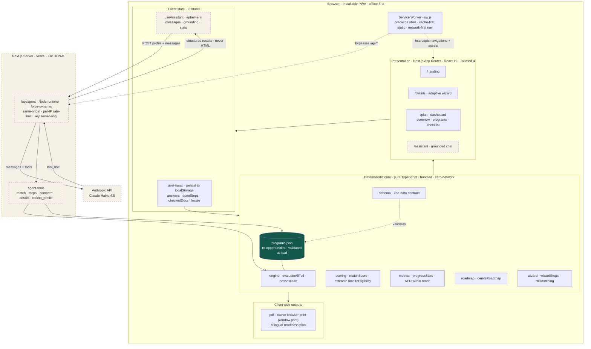
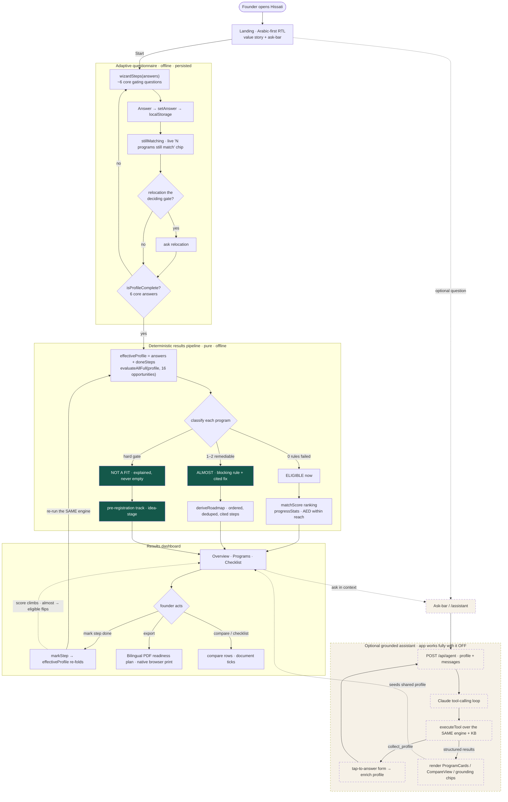

# Hissati — Architecture Diagrams

Three views of the same system, derived directly from the shipped source (`src/`) and
validated with `mermaid.parse`. Raw sources live alongside this file in
[`docs/diagrams/`](./diagrams).

- [1. System Architecture](#1-system-architecture)
- [2. Data Model (ERD)](#2-data-model-erd)
- [3. Functionality Workflow](#3-functionality-workflow)

The whole system rests on one invariant: a **pure, deterministic core** (`engine`,
`scoring`, `roadmap`, `metrics`) runs entirely in the browser over a **bundled,
Zod-validated knowledge base**. The only network egress is a single **optional**,
server-only `/api/agent` route — and even that calls the *same* engine over the *same*
data, so the assistant can never contradict the offline core or invent a program.

---

## 1. System Architecture

Layered, offline-first PWA. The deterministic core and the 16-opportunity knowledge base are
bundled into the client, so match → score → roadmap → PDF all run with zero network. The
service worker precaches the shell and static chunks; the optional `/api/agent` route is
the lone server surface (keeps the API key off the client) and is bypassed by the cache.

> Dashed nodes are the **optional** assistant surface. Pull the API key and everything
> dashed disappears — the solid offline core is the product.

---

## 2. Data Model (ERD)

There is no SQL database. The data layer is a **bundled JSON knowledge base** (validated
against the Zod contract in `schema.ts` at module load) plus **browser `localStorage`**
for the founder's own answers and progress. This ERD is the logical contract: the static
KB entities, the entities the engine *derives* at runtime, and the persisted client state.

```mermaid
erDiagram
  PROGRAM_FILE ||--o{ PROGRAM : "contains (16)"
  PROGRAM ||--|| AMOUNT : has
  PROGRAM ||--|| AVAILABILITY : "status checked"
  PROGRAM ||--|| SOURCE : "cited by"
  PROGRAM ||--|{ RULE : "eligibility · AND-gates"
  PROGRAM ||--o{ REQUIRED_DOCUMENT : requires
  RULE ||--o| REMEDY : "may carry"
  REMEDY }o--o| PROGRAM : "links_program_id · unblocks"
  PROGRAM }o--o{ PROGRAM : "concurrent_compatible_with · stackable"

  PROFILE ||--o{ EVALUATED_PROGRAM : "engine yields"
  PROGRAM ||--o{ EVALUATED_PROGRAM : "classified as"
  EVALUATED_PROGRAM ||--|{ EVALUATED_RULE : annotates
  RULE ||--o{ EVALUATED_RULE : "+ passed flag"
  EVALUATED_PROGRAM ||--o{ ROADMAP_STEP : "almost → steps"

  HISSATI_STATE ||--|| PROFILE : "answers (Partial)"
  HISSATI_STATE ||--o{ DONE_STEP : "completed steps"
  HISSATI_STATE ||--o{ CHECKED_DOCS : "doc ticks per program"
  DONE_STEP }o--|| ROADMAP_STEP : "marks done"
  CHECKED_DOCS }o--|| PROGRAM : "keyed by id"

  PROGRAM_FILE {
    string schema_version
    string generated "ISO date"
    array  programs
  }
  PROGRAM {
    string id PK "slug · unique"
    Localized name "en + ar"
    string operator
    int    tier "1 | 2 | 3"
    enum   instrument "grant|loan|equity|accelerator|license|support"
    enum   intro_method "open_form|tamm|warm_intro|competition|email"
    array  sector_tags
    string application_url
    boolean equity "dilutive?"
    string funding_group "optional · prevents double-counting"
    string processing_time
    Localized description
  }
  AMOUNT {
    number min_aed "nullable"
    number max_aed "nullable · null = amount varies"
    number countable_max_aed "nullable · headline metric"
    enum   value_kind "finance|cash|cash_and_in_kind|in_kind|prize_pool|service|cost|variable"
    string notes
  }
  AVAILABILITY {
    enum   status "rolling|open|closed|unknown"
    string checked_date "ISO date"
    string opens "optional"
    string closes "optional"
    string next_cycle "optional"
  }
  SOURCE {
    string url
    string verified_date "ISO date"
    enum   confidence "confirmed|reported|estimated"
    string method
  }
  RULE {
    enum   field "nationality_ownership|location|stage|registration|sector|relocation_willing|business_age|employee_count|gender|farm_tenure|social_impact"
    enum   op "in|gte|lte|eq|is_true"
    union  value "string[] | string | number | boolean"
    Localized blocking_message "shown when failed"
  }
  REMEDY {
    Localized action "the next step"
    string links_program_id FK "→ PROGRAM.id"
    number est_cost_aed "nullable"
    string est_time "e.g. 1-3 days"
  }
  REQUIRED_DOCUMENT {
    string en
    string ar
    string format
  }
  PROFILE {
    enum   nationality_ownership "emirati_majority|emirati_minority|gcc|expat"
    enum   location "al_quaa_al_ain|abu_dhabi_other|sharjah|dubai|other_uae|outside_uae"
    enum   stage "idea<mvp<early_traction<established"
    enum   registration "none<lt_1yr<reg_1_2yr<reg_2yr_plus"
    enum   sector "camel|dates|astro_tourism|handicrafts|food_processing|retail_services|tech|other"
    enum   funding_type "grant|loan|equity|unsure"
    enum   amount_band "lt_50k|50_200k|200_500k|500k_2m|2m_plus"
    boolean relocation_willing "optional · conditional gate"
    enum   gender "female|male · optional"
    boolean farm_tenure "optional"
    boolean social_impact "optional"
    number business_age_years "optional"
    number employee_count "optional"
    enum   team "solo|cofounder|technical_cofounder · optional"
    boolean has_pitch_deck "optional"
    boolean has_financials "optional"
  }
  EVALUATED_PROGRAM {
    string status "eligible | almost | not_fit"
    array  rules "annotated EvaluatedRule[]"
    array  failedRules
    int    matchScore "0-100 · derived"
  }
  EVALUATED_RULE {
    boolean passed "did THIS profile pass?"
    boolean remediable "does it carry a remedy?"
  }
  ROADMAP_STEP {
    string key PK "e.g. registration:lt_1yr"
    object mutate "Partial Profile advance"
    Localized action
    number months "for ordering"
    array  unlocks "programs moved toward eligible"
  }
  HISSATI_STATE {
    string storageKey "localStorage · hissati-v1"
    enum   locale "ar | en · Arabic-first"
  }
  DONE_STEP {
    string key PK "stable step id"
    object mutate "the profile advance"
    Localized label "for undo trail"
  }
  CHECKED_DOCS {
    string programId FK "→ PROGRAM.id"
    array  indices "checked document positions"
  }
```

**How to read it.** The top cluster is the **immutable, cited knowledge base**. `PROFILE`
+ `EVALUATED_*` + `ROADMAP_STEP` are **derived at runtime** by the engine — never stored
in the KB. `HISSATI_STATE` is the only **mutable, persisted** state (the founder's
answers, completed steps, and document ticks in `localStorage`). A completed `DONE_STEP`
advances the `PROFILE`, which re-flows the whole evaluation — that is the entire live
re-check, with no special-casing.

---

## 3. Functionality Workflow

The end-to-end journey, with the two properties that define the product called out:
the **no-dead-ends guarantee** (every profile yields an eligible match, a cited roadmap,
or a pre-registration track — never an empty screen) and the **live re-check loop**
(mark a step done → re-run the *same* engine → AED-within-reach climbs and "almost"
cards flip to "eligible").

> The dark nodes (`ALMOST`, `NOT A FIT`, pre-registration) are the no-dead-ends guarantee:
> all three terminal buckets still hand the founder a concrete, cited next move.

---

*Diagram sources: [`docs/diagrams/01-system-architecture.mmd`](./diagrams/01-system-architecture.mmd) ·
[`02-database-erd.mmd`](./diagrams/02-database-erd.mmd) ·
[`03-functionality-workflow.mmd`](./diagrams/03-functionality-workflow.mmd). All three pass `mermaid.parse`.*
